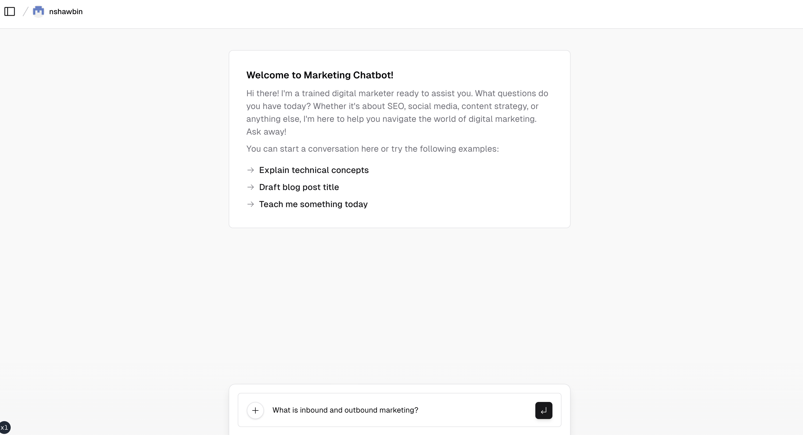
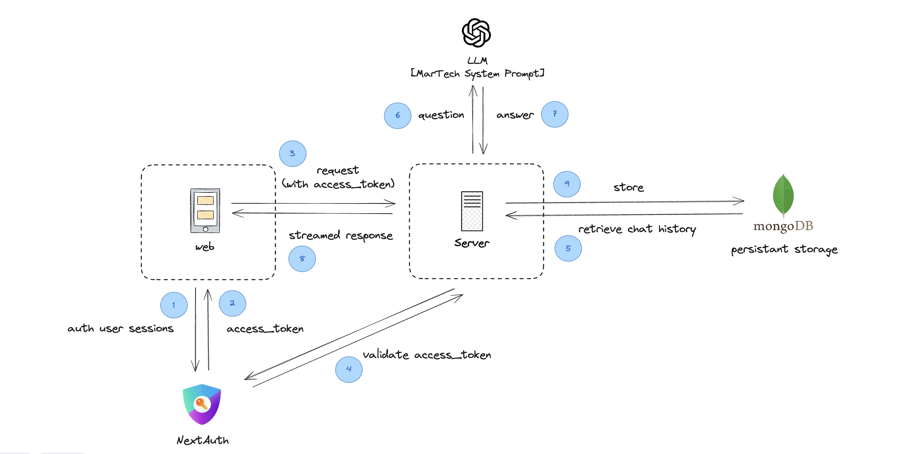

<h1>Marketing App Chatbot</h1>


<p>
  An open-source AI marketing chatbot app template built with Next.js, the Vercel AI SDK, OpenAI, LangChain, and MongoDB.
</p>

<p >
  Forked from <a href="https://github.com/vercel/ai-chatbot"><strong>NextJs AI Chatbot</strong></a>
</p>

#### Authors
- Jared Palmer ([@jaredpalmer](https://twitter.com/jaredpalmer)) - [Vercel](https://vercel.com)
- Shu Ding ([@shuding\_](https://twitter.com/shuding_)) - [Vercel](https://vercel.com)
- shadcn ([@shadcn](https://twitter.com/shadcn)) - [Vercel](https://vercel.com)

<br/>

## Features

- [Next.js](https://nextjs.org) App Router
- React Server Components (RSCs), Suspense, and Server Actions
- [Vercel AI SDK](https://sdk.vercel.ai/docs) for streaming chat UI
- LangChain framework to interact with OpenAI model
- [shadcn/ui](https://ui.shadcn.com)
  - Styling with [Tailwind CSS](https://tailwindcss.com)
  - [Radix UI](https://radix-ui.com) for headless component primitives
  - Icons from [Phosphor Icons](https://phosphoricons.com)
- [MongoDB](https://www.mongodb.com/): Chat History, User Chat list
- [NextAuth.js](https://github.com/nextauthjs/next-auth) for authentication

<br/>

## Coming Soon
- [Mongoose](https://mongoosejs.com/): ORM for mongoose
- [Vercel KV](https://vercel.com/docs/storage/vercel-kv): Rate limiting
- Authentication provider
  - Github, Google, Twitter
  - Email
  - Credentials

<br/>

## Architecture



## Running locally
### Env File
Create `.env` file. You will need to use the environment variables [defined in `.env.example`](.env.example) to run the Marketing Chatbot.

> Note: You should not commit your `.env` file or it will expose secrets that will allow others to control access to your various OpenAI and authentication provider accounts.


```bash
npm i --legacy-peer-deps
npm run dev
```

Your app template should now be running on [localhost:3000](http://localhost:3000/).
